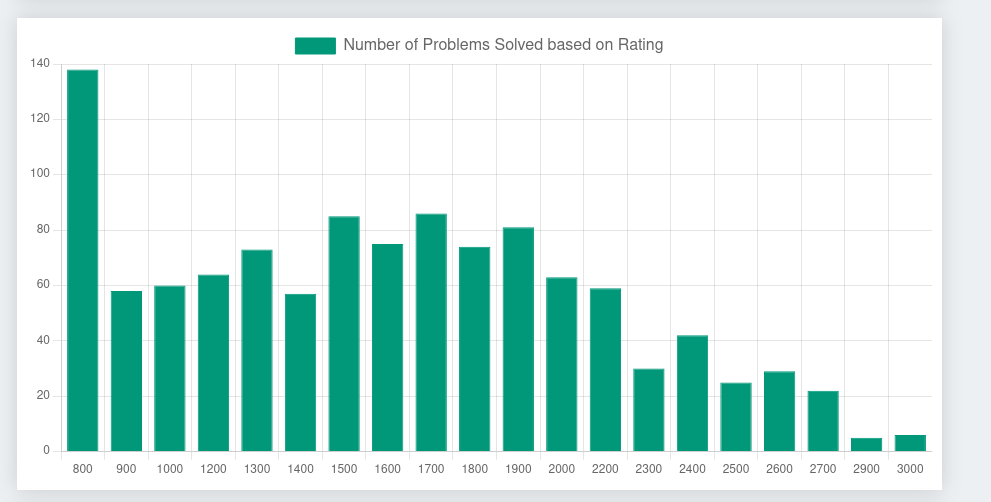
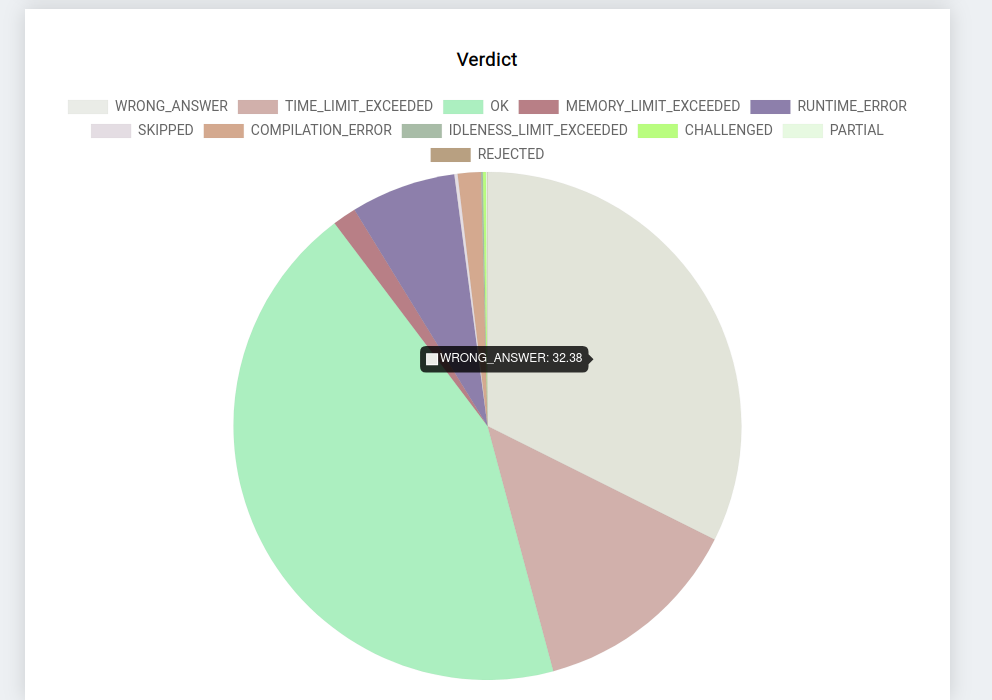

# Codeforces Visualizer

Codeforces Visualizer is a web app created for competitve coding enthusiast to track their journey of Competitive coding on codeforces. This app provides various insightfull information about user handle by represnt data using charts. This app is created using React JS and Chart JS. 

## Usage

### Handle Information

### Rating Chart And table

### Bar Graph of Number of Problem solved based on Level

### Bar Graph of Number of Problem solved based on Rating

### Doughnaut chart on Problem Solved based on Tags

### Piechart on Programming Languages Used and Overall Verdict on Problems

